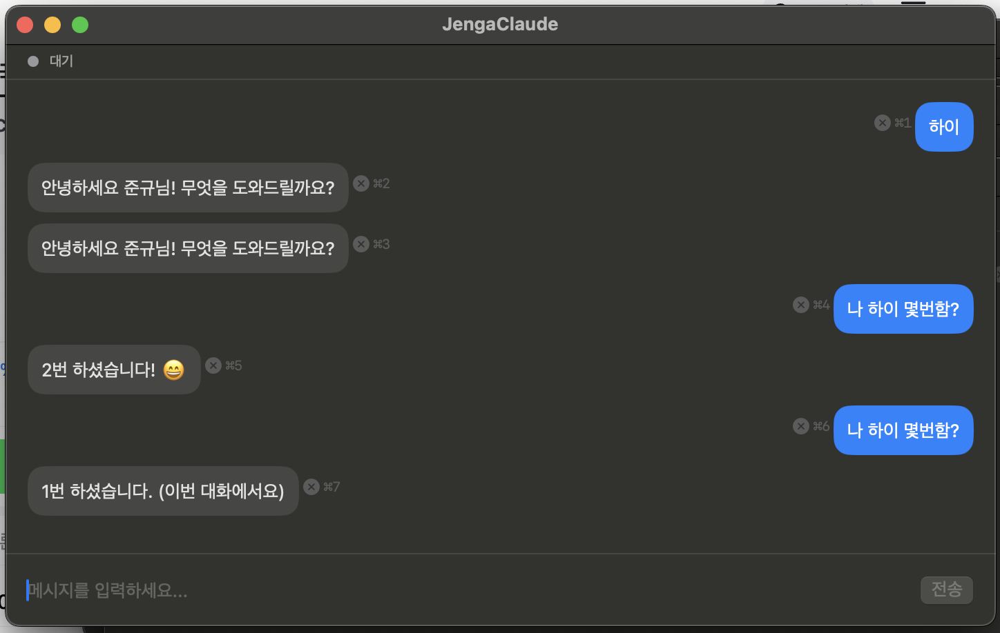

# Jenga Claude

컨텍스트를 익스트림하게 줄이는 실험. 대화 블록을 젠가처럼 빼서, 최소한의 맥락만으로 AI와 대화한다.



## 왜?

LLM 대화에서 컨텍스트는 비용이고 노이즈다. 긴 대화일수록 불필요한 맥락이 쌓여 응답 품질이 떨어진다. 필요 없는 블록을 빼면 어떻게 될까? 최소 컨텍스트로 최대 품질을 뽑아내는 실험.

## 단축키

| 단축키 | 동작 |
|--------|------|
| `⌘1`~`⌘9` | 해당 번호의 메시지 블록 삭제 |
| `⌘Enter` | 메시지 전송 |

## 빌드 & 실행

```bash
swift build
swift run
```

macOS 14+ / Swift 5.9+ 필요. `claude` CLI가 PATH에 있어야 함.

## 구조

```
Sources/JengaClaude/
├── Models/
│   ├── Message.swift              # 메시지 모델
│   ├── ClaudeEvent.swift          # NDJSON 이벤트 파싱
│   └── ConversationFormatter.swift # 대화 히스토리 포맷
├── Services/
│   └── ClaudeProcess.swift        # claude CLI 프로세스 관리
└── Views/
    ├── ChatView.swift             # 메인 채팅 UI
    └── MessageView.swift          # 메시지 블록 + 삭제 버튼
```

## 동작 방식

1. 매 메시지마다 새 `claude --print` 세션을 생성 (stateless)
2. 이전 대화 히스토리를 프롬프트에 포함하여 전송
3. 블록을 삭제하면 히스토리에서 제거 → 다음 대화에 반영되지 않음
