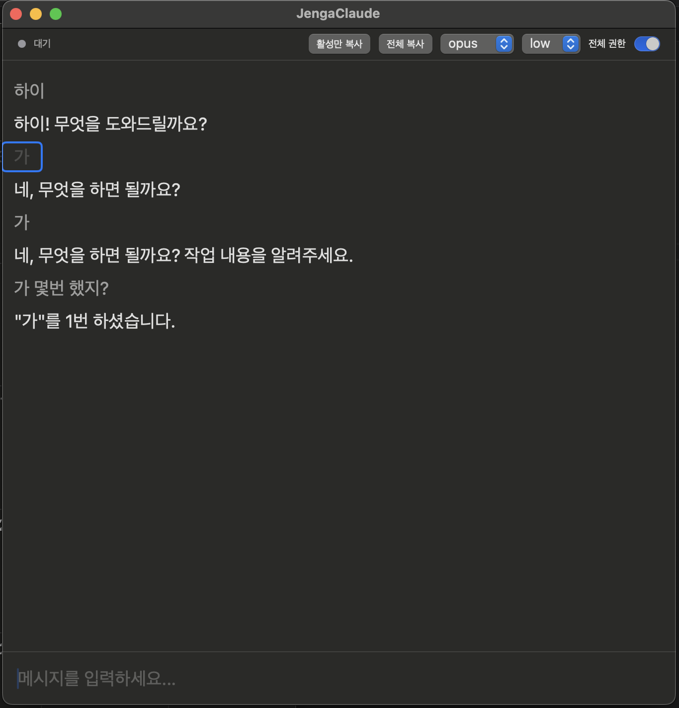

# Jenga Claude

LLM 대화의 컨텍스트 제어권을 사용자에게. 메시지 블록을 젠가처럼 빼고 넣으며, 모델·effort·대화 범위를 직접 조절한다.


## 왜?

LLM 대화에서 컨텍스트는 비용이고 노이즈다. 긴 대화일수록 불필요한 맥락이 쌓여 응답 품질이 떨어진다. 어떤 맥락을 보낼지, 어떤 모델에 얼마만큼의 리소스로 보낼지를 사용자가 직접 결정한다.

## 컨텍스트 조절

- 메시지를 **비활성화**하면 다음 대화 히스토리에서 제외된다
- 비활성 메시지는 30% 투명도로 표시되며, 언제든 다시 활성화할 수 있다
- 매 메시지마다 새 claude 프로세스를 생성하고, 활성 메시지만 히스토리에 포함하여 전송한다



"가"를 2번 입력한 뒤 첫 번째 "가"를 비활성화하면, AI는 활성 메시지만 보고 "1번"이라고 답한다.

## 단축키

### 메시지 토글

| 단축키 | 동작 |
|--------|------|
| `⌘1`~`⌘9` | 해당 번호의 메시지 토글 |
| `⌘⇧←` / `⌘⇧→` | 커서 위치 메시지 토글 |
| `Option+클릭` | 클릭한 메시지 토글 |
| `⌘⇧A` | 전체 토글 |

### 커서 이동

| 단축키 | 동작 |
|--------|------|
| `⌘⇧↑` | 커서 위로 |
| `⌘⇧↓` | 커서 아래로 |

### 모델 · Effort

| 단축키 | 동작 |
|--------|------|
| `⌘M` | 모델 전환 (opus → sonnet → haiku) |
| `⌘E` | effort 전환 (low → medium → high) |

### 기타

| 단축키 | 동작 |
|--------|------|
| `Enter` | 메시지 전송 |
| `ESC` | 응답 중단 |
| `Ctrl+U` / `Ctrl+D` | 위/아래 스크롤 |
| `⌘+` / `⌘-` | 글씨 크기 조절 |
| `⌘⇧C` | 활성 메시지만 복사 |
| `⌘⇧X` | 전체 메시지 복사 |

### 명령어

| 명령어 | 동작 |
|--------|------|
| `/cl` | 대화 초기화 |

## 빌드 & 실행

```bash
swift build
swift run
```

macOS 14+ / Swift 5.9+ 필요. `claude` CLI가 PATH에 있어야 함.

## 구조

```
Sources/JengaClaude/
├── JengaClaudeApp.swift           # 앱 진입점, 메뉴 단축키
├── Models/
│   ├── Message.swift              # 메시지 모델
│   ├── ClaudeEvent.swift          # NDJSON 이벤트 파싱
│   └── ConversationFormatter.swift # 대화 히스토리 포맷
├── Services/
│   └── ClaudeProcess.swift        # claude CLI 프로세스 관리
└── Views/
    └── ChatView.swift             # 메인 채팅 UI
```

## 동작 방식

1. 매 메시지마다 새 `claude --print` 세션을 생성 (stateless)
2. 활성 메시지만 히스토리에 포함하여 전송
3. 메시지를 비활성화하면 다음 대화에 반영되지 않음
